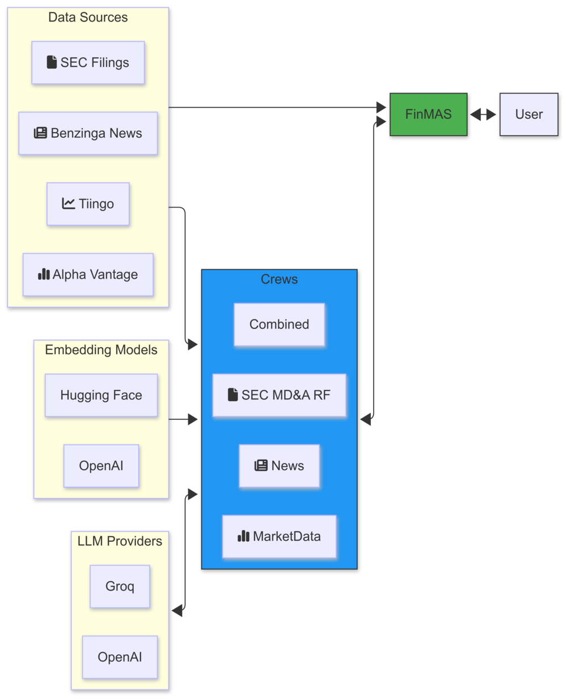

<div align="center">

# FinMAS: Financial Analysis using LLM Multi-Agent Systems

<h3>

[Documentation](https://ivarurdalen.github.io/finmas/) |
[Example Outputs](https://ivarurdalen.github.io/finmas/examples_index/)

</h3>

[](https://docs.crewai.com/introduction)
[](https://docs.llamaindex.ai/en/stable/)
[](https://platform.openai.com/docs/models)
[](https://console.groq.com/docs/overview)
[](https://huggingface.co/models?other=embeddings)
[](https://panel.holoviz.org/)
[](https://opensource.org/licenses/MIT)

</div>

This project was initially developed during the Capstone Project at
[MScFE at WorldQuant University](https://www.wqu.edu/mscfe). The project have later been updated to
work with the current LLM models that are available.

This repo is a web app that is a playground for LLM multi-agent systems for solving tasks in the
financial domain. We use the [CrewAI](https://docs.crewai.com/introduction) framework to orchestrate
the agents, and the [LlamaIndex](https://docs.llamaindex.ai/en/stable/) framework to creating vector
store index from unstructured text data like News and SEC filings.

[4 crews](https://ivarurdalen.github.io/finmas/crews/) have been created that have different focus,
with different data sources.\
A final [combined crew](https://ivarurdalen.github.io/finmas/crews/combined/) is created\
that combines data from news, SEC filings and market data to provide a final stock analysis that\
includes a recommendation.

The following screenshots illustrate a output from the combined crew and the main dashboard.

### Combined analysis


### Main dashboard


## Web app architecture

The following diagram shows how the different components of the web app are connected together.



## Getting started

## 1. Installation

To use the web app, do the following:

1. Clone the repo

```shell
git clone https://github.com/ivarurdalen/finmas.git
cd finmas
```

2. Create a virtual environment and install the dependencies into the environment.

We recommend using the [uv package manager](https://github.com/astral-sh/uv) to install the
dependencies.

From the root of the project run the following command to install the latest dependencies without
the development dependencies:

```shell
uv sync --upgrade --no-dev
```

3. Set up `.env` file with necessary API keys.

## 2. Running the app

Activate the virtual environment and start the server by using `panel`:

```shell
source .venv/bin/activate  # macOS or Linux
.venv\Scripts\activate  # Windows
panel serve src/finmas/panel/app.py --show
```

If you want to start the app with a specific ticker like `NVDA`:

```shell
panel serve src/finmas/panel/app.py --show --args NVDA
```

We use [Alpha Vantage](https://www.alphavantage.co/) to get fundamental data (income statements).\
You can create your `.env` file by copying the `.env.template` file in the repo. Set the following
API keys in the `.env` file in the repo folder:

- [TIINGO_API_KEY](https://www.tiingo.com/products/stock-api) for stock price data.
- [ALPHAVANTAGE_API_KEY](https://www.alphavantage.co/) for fundamental data.
- [ALPACA_API_KEY](https://docs.alpaca.markets/docs/historical-news-data) and `ALPACA_API_SECRET`
  for access to Benzinga Historical News API.
- [GROQ_API_KEY](https://console.groq.com/playground) for access to running Groq models.
- [OPENAI_API_KEY](https://platform.openai.com/settings/organization/api-keys) for accessing OpenAI
  models `gpt-4o` and `gpt-4o-mini`.
- [HF_TOKEN](https://huggingface.co/settings/tokens) for access to HuggingFace embedding models.

### Virtual environment

To install the virtual environment, we use the extremely fast
[uv project manager](https://github.com/astral-sh/uv).

Install `uv` using [the standalone installer](https://github.com/astral-sh/uv?tab=readme-ov-file#installation).
To create or sync a virtual environment the following command can be used in the project folder:

```bash
uv sync
```

To exclude the development dependencies (like `pre-commit`) append the `--no-dev` flag to the
command:

```bash
uv sync --no-dev
```

To add or remove packages, simply use `uv add <package>` or `uv remove <package>`.

Activate the virtual environment with the following command:

```bash
source .venv/bin/activate  # macOS or Linux
.venv\Scripts\activate  # Windows
```
