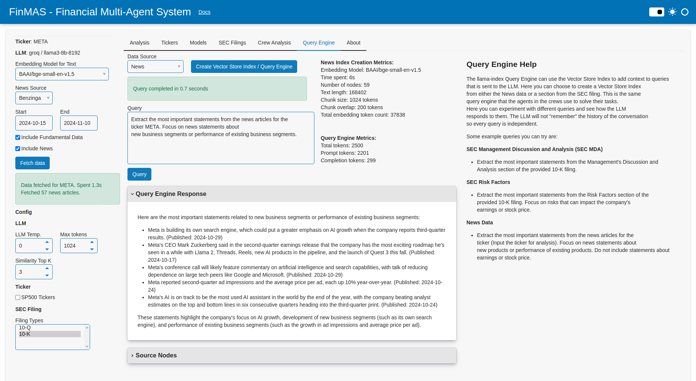

---
hide:
  - toc
---

# Query Engine

The Query Engine tab of the app allows the user to query the data source directly from the UI.
It is possible to choose the News data that is loaded, or a section from the selected SEC filing.
First, it is necessary to create a [Vector Store Index](https://docs.llamaindex.ai/en/stable/module_guides/indexing/vector_store_index/)
before the data can be queried with the LLM and the query engine. Some example of queries are shown
on the page to get started.

This is a great tool to investigate which type of description should be used for the tasks that are
given to the LLM agents.

