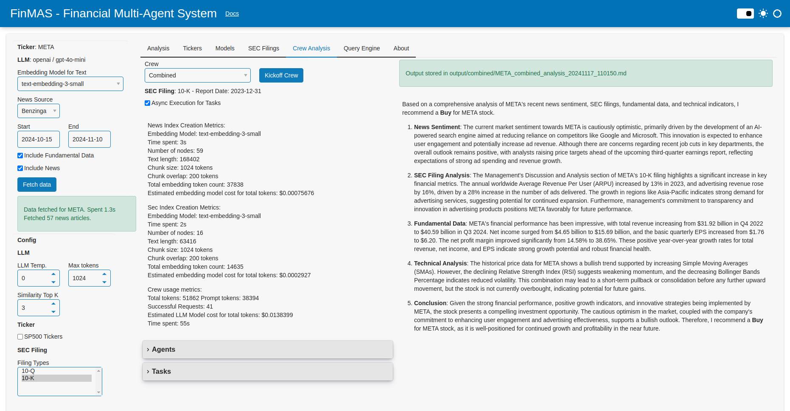

---
hide:
  - navigation
---

# FinMAS - Financial Analysis Multi-agent System

This app uses LLM agents organized in a multi-agent system to analyze financial data
and perform financial tasks. The app is developed during the final capstone project of the
[WorldQuant MSc in Financial Engineering](https://www.wqu.edu/mscfe).

It is meant as a practical and educational app that demonstrates the state-of-the-art of LLM models applied
to tasks in the financial domain, and with an extra focus on open source models and packages.

Please visit [GitHub repo](https://github.com/ivarurdalen/finmas) for further information.

See our [Tutorial](tutorial/index.md) to get started, and see some
[example outputs](https://github.com/ivarurdalen/finmas/tree/main/output/examples)
to understand better what the multi-agent systems can do.

## Features

- **Extracting insights from unstructured data:** Analyze unstructured data such as SEC filings and
  News articles together with fundamental company data.
- **Transparent:** Get insight into token usage, performance and the data fed to the system to gain confidence in the result.
- **Configurable:** Adjust parameters and model selection to optimize the performance of the system.
- **Ticker focused:** Select a major ticker listed on NASDAQ or NYSE for analysis.
- **Multiple LLMs supported:** Use LLM from an hosted provider such as Groq or HuggingFace, or OpenAI GPT models.
- **Multiple agent systems supported:** Use defined crews of agents to perform dedicated analysis on
  news or SEC filings, or combine them for a final analysis.
- **Query directly the data source:** Use the same tool as the agents to query the data source directly from the UI.
  Powered by [llama-index's query engine](https://docs.llamaindex.ai/en/stable/understanding/querying/querying/).

The following screenshots illustrate a output from a combined analysis crew and the main dashboard.

## Combined analysis

## Main dashboard

