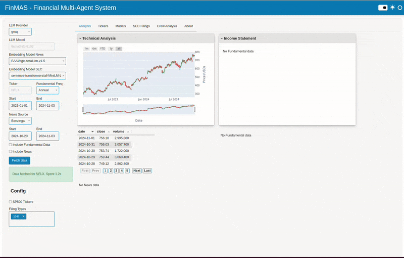

# Tutorial: News Analysis

1. Install and start the app as described in the [README](https://github.com/ivarurdalen/finmas) of the project.

2. The news data is not loaded when you start the app, so the checkbox
   for including news data needs to be ticked.

3. Then click the button `Fetch Data` to download news from the selected source and in the data
   range that is specified. This will create a table in the main dashboard where each article
   can be inspected. The content as well as the metadata of the article can be viewed.
   The news articles are loaded into memory.

4. After the news data have been loaded, it is possible to run the News Analysis crew.
   Click on the Crews tab. Configure the parameters if necessary and click the `Run Crew` button.

5. To create a crew, a Vector Store Index is created from the news articles.
   This makes it possible for an LLM to get the most relevant news articles by using
   an [embedding model](../components/embedding_models.md).

6. After the Vector Store Index is created, then the Crew is initialized with their
   configuration. The analysis will take some time, but when it is finished the
   results are displayed in the output area. Metrics for the analysis is also displayed, and
   the final result is stored in the output folder.

